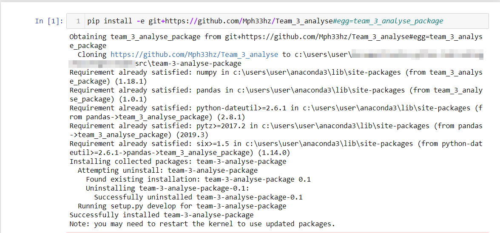
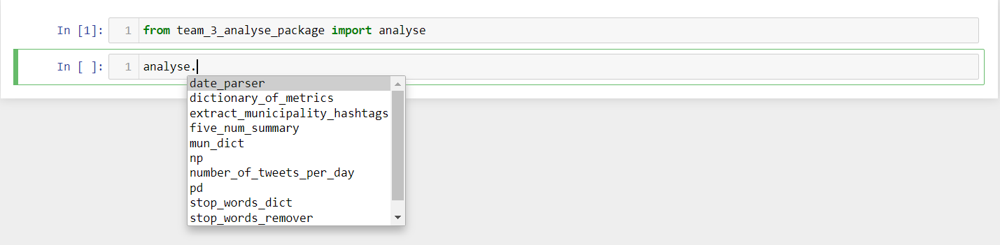
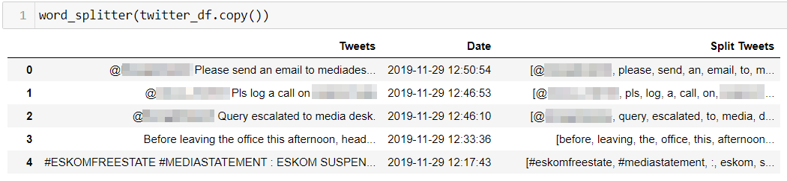

# Explore Data Science Academy Team 3 - Analyse 
### We have built a package consisting of 7 python functions that compute and analyse structured and unstructured data

## Installing the package from github

pip install -e git+https://github.com/Mph33hz/Team_3_analyse#egg=team_3_analyse_package

## Importing modules

## ugrading the package from github

pip install --upgrade pip install -e git+https://github.com/Mph33hz/Team_3_analyse#egg=team_3_analyse_package

## Function : Word_Splitter

''' This function splits sentences in a dataframe's column by whitespaces into a list
    of seperate words and returns the dataframe with a new column
    named 'Split Tweets' that holds a the list of words. The function also converts the the words in the new column 
    into lower case words. The process this function does is known as Tokenization

    args:
        df(Dataframe): The function takes in a pandas dataframe with a column named 'Tweets' as input, this column should holds
        sentences.

    return:
        df(dataframe): A  modified pandas dataframe with a new column named 'Split tweets'
        that holds a list of lower case seperate words.
        
    # Notes
           Pandas and Numpy should be imported to used this function
### Word_Splitter Example

    
## Function : Number of Tweets per Day

''' This function takes in a pandas dataframe as input. It returns a new dataframe that is grouped by day and uses the index to count the number of tweets for that day. The new dataframe index is named 'Date' and the new column 'Tweets', and they correspond to the Date and the number of tweets for that day, respectively. 

    args:
        pandas.index.name(): naming of the index on the new added data frame.
        Index.value_counts(): returns object containing counts of unique values.
        pd.DataFrame(): new data frame.
        DataFrame.sort_index. Sort object by labels
        
    return:
        df(index.name, dataframe): A new dataframe with a new index column
        containing the dates sorted and a column of tweets counted per day.
 
    # Notes

    Pandas should be imported to use this function.   
    
    
## Function : Date Parser

   This function takes in a string consisting of a date and time
   in the form 'yyyy-mm-dd hh:mm:ss and returns just the date in
   the form 'yyy-mm-dd'

    args:
        dates: A list consisting of strings in the format 'yyyy-mm-dd hh:mm:ss'
        newList: A list consisting of dates only in the form 'yyyy-mm-dd'
        from the dates variable.

    return:
        returns a list that consists only of the first 10 words/characters in
        each string, thus outputting only the date in the form 'yyyy-mm-dd'

### Function 4: Extract Muncipality and Hastag from Existing DataFrame

    This Function takes in a DataFrame(twitter_df) as an input with data,indexes and columns from a HTLM source and it is saved as 
    pandas Dataframe to analyse the twitter information about Eskom, and returns a new Datframe(twitter_df_copy) with additional
    columns ('Municipality') and ('Hashtag') both columns are created from extracting a pandas series from the original DataFrame.

    Args:
        DataFrame: DateFrame(Twitter_df) with Data,Index and Colums

    Return:
         DataFrame: A DataFrame with additional columns from existing DataFrame with data     

 ##  Metric Dictionary

     This function that calculates the mean, median, variance, standard deviation, minimum and maximum of of list of items. The given list should contain only numerical entries.       
    
    Args:
        items(list[int]) a list of intergers.

    Returns:
         a dict with keys 'mean', 'median', 'std', 'var', 'min',
         and 'max', corresponding to the mean, median, standard deviation, variance, minimum and maximum of the input list, respectively. All rounded to two decimal places.

## Five Number Summary

     This function takes in a list of integers and returns a dictionary of the five number summary:
     consists of five values: the most extreme values in the data set (the maximum and minimum values), the lower and upper quartiles, and the median.
    
    Args:
        items(list[int]) a list of intergers

    Returns:
        dict: a dict with keys 'max', 'median', 'min', 'q1',
        and 'q3' corresponding to the maximum, median, minimum,
        first quartile and third quartile, respectively rounded
        to two decimal places.
        
## Stop Words Remover

   This function removes all english stop words from a tokenised list
   in a dataframe's column and returns the modified dataframe with a new
   column named 'tweets_without_stopwords' that holds a tokenised list
   without english stop words.
   
   
    args:
        df(Dataframe): A pandas dataframe with a column named 'Tweets'.
    return:
        df(dataframe): A modified pandas dataframe consisting of a new
        column named 'tweets_without_stopwords' that holds a list of
        tweets that have no stop words.
    
 
    
    
